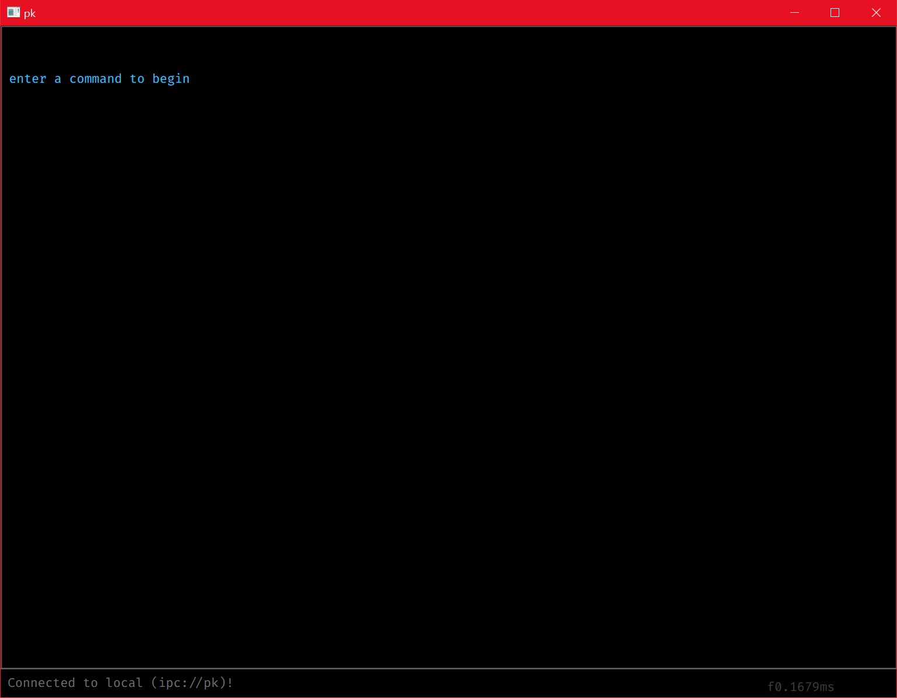

# Pk #

A Vim-like text editor for the modern age. The goal of Pk is to provide a clean, fast editing/coding experience that works just as well
remotely as it does locally.  

Pk is currently in alpha - it definitly is not perfect! However it is decently usable for editing, and in fact has been used for its own 
development for a time now.

## Usage

As of right now, the best way to get Pk is from source. This isn't too bad if you already have Rust, as we use Cargo. 
Building Pk with `cargo build --release` will get you two executables:

### `pk-client`
    
This is the actual editor client.
Command line usage: `pk-client [--config <replacement configuration file> | --default-config] [--server <URL>] [files to edit...]`

By default, pk-client will try to connect to a server at `ipc://pk`, which it will name `local`.
See all configurable options in `default.config.toml`, including fonts, colors, autoconnection, etc., as well as where to place the file. 
    
### `pk-server`

This is the server process, which takes care of things like managing files on the file system. You can connect to one server from
multiple `pk-client` instances, but be wary of conflicting edits, Pk is **not** a version control system, although it will ask about what to do,
not clobber files. This part allows you to use Pk remotely, but you'll need a server running on your local machine to use Pk as well.

Command line usage: `pk-server <nng URL>`

Any valid [nng](https://nng.nanomsg.org) URL will work, for example to listen on an IPC channel use `ipc://<name of channel>`
or to listen on a TCP socket use `tcp://*:<port number>`. `pk-server` automatically loads `filetypes.toml` at load, expecting to find it
in the current directory.

## User interface

Pk is like Vim, so things like Normal/Visual/Insert mode exist and function largely as you might expect. However there are some differences,
it isn't a Vim clone by any means. 
     
### Message mode

Pk prints error and status messages at the bottom of the screen. In order to interact with or clear the messages, you'll need to enter
Message mode, by pressing `<C-e>`.

- `e` - clear all messages
- `j` and `k` to change selected message
- `Enter` or `Backspace` or `Delete` to clear a selected message
- `0-9` on messages with numbered options to select an option
- `Esc` to return to Normal mode

### Window panes

Pk has window panes built in. However unlike Vim, the cursor index is tied to the buffer, not the pane. If you want to look at two files
in different places, use `zs` to disable Scroll Lock in a pane (`zj` and `zk` can still be used to move by lines). 

- `<Space>s` - split pane horizontally
- `<Space>v` - split pane vertically
- `<Space>(h,j,k,l)` - move to an adjacent pane
- `<Space>x` - delete a pane

### Command line

Pk doesn't yet support any Ex commands (although `/` and `?` work).

- `e <path>` - open a file for editing, optionally on a different server by name like `<server name>:<path to file>`, by default uses the `local` server
- `con <name> <url>` - connect to a different server
- `sync` - forces a sync with the server for the current buffer
- `b <path fragment>` - switches to the buffer with the closest fuzzy match for `<path fragment>`
- `bx <path fragment>` - closes the buffer with the closest fuzzy match for `<path fragment>`
- `bl <path fragment>` - shows an info message with all buffer paths that match `<path fragment>` 

Notice the lack of `w`! Pk automatically makes sure that files up-to-date on the filesystem via an autosave mechanism.

Pk © 2020 Andrew Palmer; see LICENSE for legal details.

